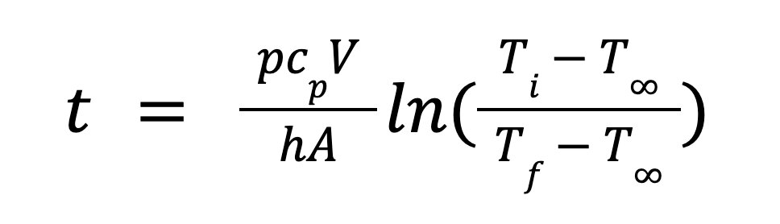
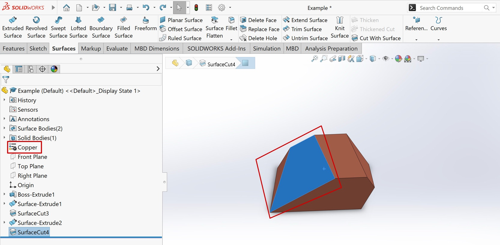
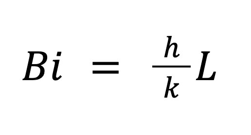

# SolidWorksLumpedCooling

This VBA program runs through Solidworks and estimates the time required for a part to be cooled using the lumped capacitance cooling equation:

  

Where p is the density, c_p is the specific capacity, h is the convective heat transfer coefficient, V is volume, A is area, and T is the temperatures.

#### The available coolants are:
- Air (natural)
- Air (forced)
- Water
- Water-Glycol
- Oil
- Boiling Coolant

The h values for these coolants are estimated from the [Fundamentals of Mass and Heat Transfer](https://charlaenlamesadelcasino.wordpress.com/wp-content/uploads/2014/01/fundamentals-of-heat-and-mass-transfer-incropera.pdf)

## Inputs

  

- Select one or more faces which represent the contact points for the coolant
- Add the material
- Initial, final, and coolant temperatures
- Which coolant to apply

## Output
The program will automatically retrieve the [density](https://help.solidworks.com/2022/english/api/sldworksapi/Get_and_Set_Material_Density_Example_VB.htm), specific capacity, volume and areas to calculate and output the time reqiured for this part to be cooled in seconds/minutes.

## Assumptions
- Uniform temperature distribution
- Uniform specific capacity
- Negligable heat loss
- Constant thermal properties
- Reasonable initial and final temperatures
- Biot Number (Bi) < 0.1

  

where k is thermal conductivity and L is depth/length.
